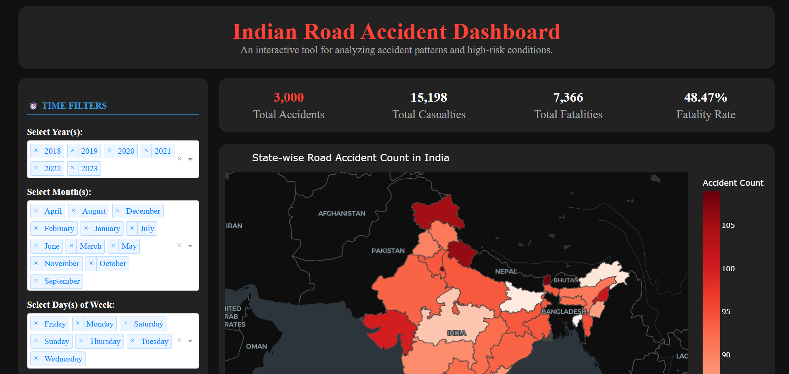

# 🚦 Indian Road Accident Dashboard 🇮🇳

🔗 **Live Demo:**\
https://mr-robot369-indian-road-accident-dashboard.hf.space/

  

------------------------------------------------------------------------

## 📌 Overview

The **Indian Road Accident Dashboard** is an interactive data
visualization application built using **Plotly Dash** to analyze and
explore road accident statistics across India.\
It provides **state-wise, temporal, and trend-based insights** into road
accidents through dynamic charts and maps.

The dashboard is **deployed for free on Hugging Face Spaces** using
Docker, ensuring public accessibility and reproducibility.

------------------------------------------------------------------------

## 🎯 Objectives

-   Analyze road accident patterns in India\
-   Visualize state-wise accident distribution\
-   Study year-wise and trend-based variations\
-   Provide an interactive, user-friendly dashboard for analysis and
    awareness

------------------------------------------------------------------------

## 🧩 Key Features

-   Interactive Plotly charts with hover, zoom, and filters\
-   State-wise road accident analysis\
-   Year-wise and trend-based visualizations\
-   Choropleth map of India showing accident intensity\
-   Optimized performance using modular chart functions\
-   Plotly and Dash assets served locally\
-   Clean, scalable, and modular codebase\
-   Public deployment on Hugging Face Spaces

------------------------------------------------------------------------

## 🛠️ Tech Stack

-   **Frontend / Visualization:** Plotly, Dash\
-   **Backend:** Python\
-   **Data Handling:** Pandas, NumPy\
-   **Deployment:** Docker, Hugging Face Spaces\
-   **Version Control:** Git

------------------------------------------------------------------------

## 📂 Project Structure

    indian-road-accident-dashboard/
    │
    ├── app.py
    ├── charts.py
    ├── data/
    │   └── accident_preprocessed.csv
    │
    ├── assets/
    │   └── styles.css
    │
    ├── requirements.txt
    ├── Dockerfile
    └── README.md

------------------------------------------------------------------------

## 🚀 Deployment Details

-   **Platform:** Hugging Face Spaces\
-   **Deployment Type:** Docker-based\
-   **Hosting Cost:** Free\
-   **Public URL:**\
    https://mr-robot369-indian-road-accident-dashboard.hf.space/

------------------------------------------------------------------------

## 🧠 Performance Optimizations

-   Local serving of Plotly and Dash assets to avoid CDN latency\
-   Lazy-loaded charts using callback-based rendering\
-   Modularized chart generation logic\
-   Pinned dependencies for stable and reproducible builds

------------------------------------------------------------------------

## 📈 Use Cases

-   Academic projects and research\
-   Data visualization demonstrations\
-   Road safety analysis and awareness\
-   Resume and portfolio showcase

------------------------------------------------------------------------

## 🔮 Future Enhancements

-   Accident severity and cause-based analysis\
-   District-level visualizations\
-   Predictive analytics using Machine Learning\
-   Downloadable reports (CSV / PDF)

------------------------------------------------------------------------

## 👨‍💻 Author

**Anubhav Shukla**\
M.Sc. Data Science\
Python \| Data Science \| Visualization \| Dash

------------------------------------------------------------------------

## ⭐ Acknowledgements

-   Government open datasets on road accidents\
-   Plotly & Dash community\
-   Hugging Face Spaces for free hosting

------------------------------------------------------------------------

## 📌 Note

This project is created for educational and analytical purposes using
publicly available data.
